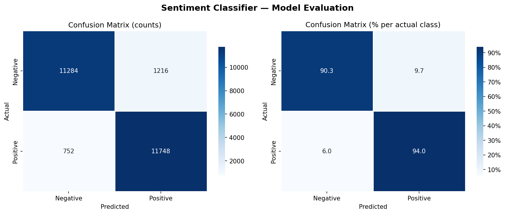
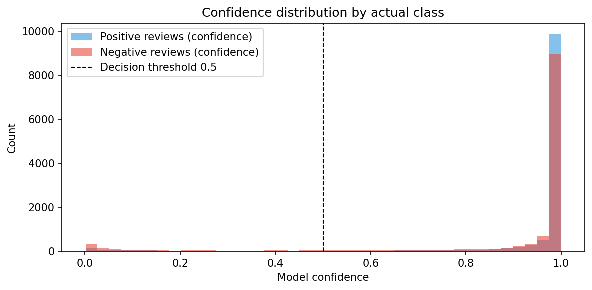

# Sentiment Analyser — Fine-tuned BERT on IMDb Reviews

A sentiment classifier that fine-tunes **BERT** (bert-base-uncased) on 50,000 IMDb movie reviews. Achieves **92.1% accuracy** on the 25,000 sample test set after 3 epochs of training. Includes a Gradio web interface with local LLM movie identification via Ollama.

---

## Results

| Metric | Value |
|--------|-------|
| Overall accuracy | **92.1%** |
| Negative F1 | 0.920 |
| Positive F1 | 0.923 |
| Macro avg F1 | 0.921 |
| Test samples | 25,000 |
| Model parameters | ~110M |

### Confusion matrix



### Confidence distribution



The model is highly confident on most predictions — the vast majority of reviews score above 0.9 confidence, with both classes correctly separated. Only 1,968 errors out of 25,000 samples, though 923 of those were high-confidence mistakes (>0.9), indicating some room for calibration improvement.

---

## How it works

```
Raw text review
      │
      ▼
BERT Tokenizer         →  token IDs + attention mask
      │                   (max 256 tokens, truncated/padded)
      ▼
BERT (bert-base-uncased)  →  contextual embeddings
  12 transformer layers       110M pretrained parameters
  768-dimensional hidden state
      │
      ▼
[CLS] token            →  sentence-level representation (768-dim)
      │
      ▼
Dropout (0.3) + Linear →  logits (2 classes)
      │
      ▼
Softmax                →  P(negative), P(positive)
```

BERT is pretrained on BookCorpus + Wikipedia (3.3B words). The whole network is fine-tuned using a lower learning rate for BERT layers (2e-5) and a higher rate for the new classification head (1e-4).

---

## Project structure

```
sentiment-ai/
├── dataset.py       # IMDb dataset loader (Hugging Face datasets)
├── model.py         # SentimentClassifier (BERT + classification head)
├── train.py         # Fine-tuning pipeline with warmup LR schedule
├── evaluate.py      # Confusion matrix + classification report
├── predict.py       # Terminal predictions (single, batch, interactive)
├── app.py           # Gradio web interface + Ollama movie identification
├── requirements.txt
└── models/          # Saved model weights (created after training)
```

---

## Quickstart

### 1. Install dependencies

```bash
pip install -r requirements.txt
```

### 2. Train on Google Colab (recommended — free GPU)

```python
!git clone https://github.com/rupa-blip/sentiment-ai.git
%cd sentiment-ai
!pip install -r requirements.txt
!python train.py --epochs 3 --batch-size 32
```

Enable GPU first: **Runtime → Change runtime type → T4 GPU**

Training takes ~50 minutes on a T4 GPU.

### 3. Train locally (CPU — slow)

```bash
python train.py --epochs 3 --batch-size 16
```

### 4. Evaluate

```bash
python evaluate.py --model models/sentiment_bert.pt
```

### 5. Run predictions

```bash
# Single review
python predict.py --text "An absolute masterpiece, one of the best films ever made."

# Interactive mode
python predict.py --interactive

# Batch from file
python predict.py --file reviews.txt
```

### 6. Launch the web interface

```bash
# Install Ollama first: https://ollama.com/download
ollama pull llama3.2      # one-time download
ollama serve              # keep this running in a separate terminal

python app.py             # opens at http://localhost:7860
python app.py --share     # generates a public link
```

---

## Controls (predict.py interactive mode)

| Input | Action |
|-------|--------|
| Any text | Analyse sentiment |
| `quit` | Exit |

---

## Key concepts demonstrated

| Concept | Where |
|---------|-------|
| **Transfer learning** | `model.py` — fine-tuning pretrained BERT |
| **Transformer architecture** | `model.py` — [CLS] token, attention, hidden states |
| **Tokenisation** | `dataset.py` — subword tokenisation, padding, truncation |
| **Differential learning rates** | `train.py` — lower LR for BERT, higher for head |
| **LR warmup + decay** | `train.py` — linear schedule with warmup |
| **Gradient clipping** | `train.py` — prevents exploding gradients |
| **Model evaluation** | `evaluate.py` — confusion matrix, F1, error analysis |
| **Local LLM integration** | `app.py` — Ollama API for movie identification |

---

## Configuration

| Flag | Default | Description |
|------|---------|-------------|
| `--epochs` | 3 | Training epochs |
| `--batch-size` | 16 | Batch size (use 32 on GPU) |
| `--max-length` | 256 | Max token length (BERT supports up to 512) |
| `--bert-lr` | 2e-5 | Learning rate for BERT layers |
| `--head-lr` | 1e-4 | Learning rate for classifier head |
| `--dropout` | 0.3 | Dropout on classifier head |

---
